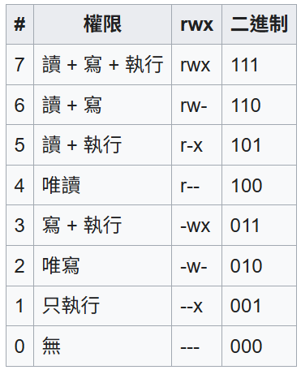

## Linux 常用指令
### 1. pwd – 列印工作路徑 
    ### pwd 指令可以找到你所在的路徑位置為何。
### 2. mkdir – 建立目錄 
    ### 一次建立單層或是多層的結構性目錄。
### 3. ls – 列出工作路徑下的檔案或是目錄清單。
    ### 作用像是 windows 系統下的 dir。
### 4. cd – 切換目錄的路徑
    ### 這個指令 windows 也有，應該很常見哦～
### 5. rm – 刪除檔案、目錄
    ### 用這個指令要特別小心呀～若是使用最高管理權限的帳號(root)刪除，就是一場災難呀～
### 6. cp – 拷貝檔案、目錄
    ### 把一個檔案、目錄複製到另一個路徑上。
### 7. mv – 移動檔案、目錄
    ### 把一個檔案、目錄移動到另一個路徑上。
### 8. touch – 建立一個空的文件檔
    ### 可以快速建立一個空的文檔檔案，常常會用在建立一個新的服務設定檔上。
### 9. chmod – 變更檔案權限
    ### 在 Linux 的世界，權限是一門很重要的資訊。
### 10. sudo – 提升權限 
    ### 通常為了安全的因素，不會使用 root 來操作 Linux 系統，所以一般帳號在使用某些指令而需用到 root 權限時，就會利用這個指令來暫時取得管理權限，以降低操作全能帳號所帶來的潛在風險。
### 11. poweroff – 關機
    ### 嗯…就是關機XD。
### 12. rmdir - 刪除資料夾
    ### 刪除已存在的資料夾
### 13. man – 萬能的男人
    ### 任何指令(包含上述指令)，只要 man 一下，就能找到對應的手冊說明哦～
### 14. cat - 顯示檔案內容
    ### 可以在終端機顯示檔案的文字內容.
### 15. chmod - 修改檔案權限
    ### chmod是一條在Unix系統中用於控制使用者對檔案的權限的命令（change mode單詞字首的組合）和函式。只有檔案所有者和超級使用者可以修改檔案或目錄的權限。可以使用絕對模式（八進制數位模式），符號模式指定檔案的權限。
    $ chmod 777 [file name]
\
### 16. unzip - 解壓縮 .zip 文件
    ### 語法 : 
     unzip [options] file.zip
    ### options 参数：
    -d <directory>：将解压缩的文件放入指定的目录。
    -l：列出 .zip 文件中的内容，但不解压。
    -v：显示详细信息，包括 .zip 文件的结构和压缩率等信息。
    -t：测试 .zip 文件的完整性，但不解压。
    -n：解压时不覆盖已存在的文件。
    -o：解压时覆盖已存在的文件，而不提示。
    -x <pattern>：解压时排除指定的文件或目录。
    -j：解压时不保留目录结构，将所有文件解压到当前目录中。
### 17. tar - 壓縮或解壓縮檔案
    ### 语法 : 
     tar [options] -f archive.tar [files...]
    ###  options 参数 : 
    #### 基本操作選項
    -c：创建一个新的归档文件。
    -x：解压归档文件。
    -t：列出归档文件的内容。
    -r：向现有归档文件中追加文件。
    -u：仅追加比归档文件中已有文件更新的文件。
    -d：找到归档文件中与文件系统不同步的差异。
    -A：将一个 .tar 文件追加到另一个 .tar 文件中。
### 18. & - 以背景方式執行程式
### 19. df - 顯示檔案相關資訊
### 20. wget - 下載網站上的檔案
### 21. whereis - 找出某指令所在資料夾位置
### 22. grep - 找出檔案中的關鍵字
### 23. ping - 找尋線路上的其他主機
### 24. ifconfig - 顯示目的網路卡狀態
### 25. clear - 清除LX 終端機螢幕訊息
