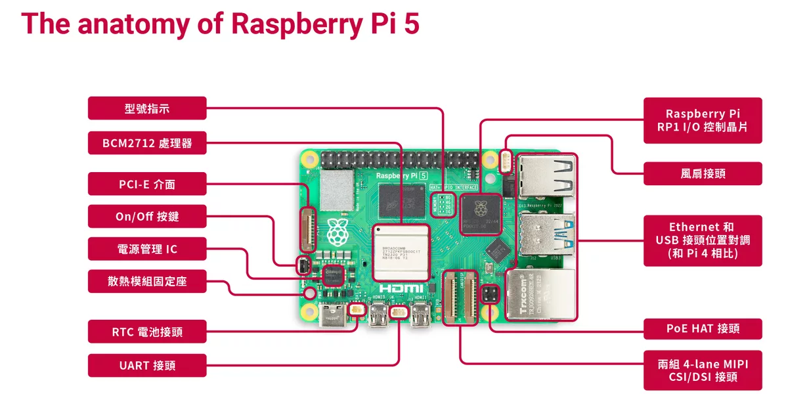
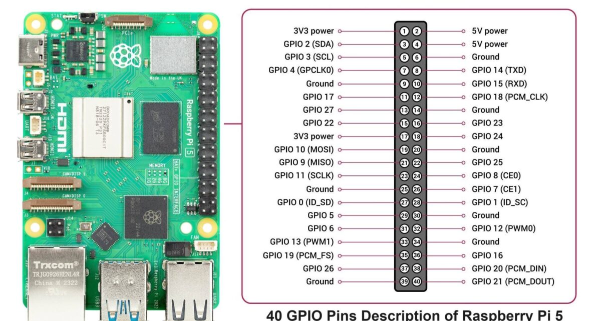

## (Pi 5) 樹莓派 Raspberry Pi 5 Model B 開發板

### Raspberry Pi 5 特色
更快的 Broadcom BCM2712 晶片，四核心（quad-core） Cortex-A76 使用 ARM v8 指令集，時脈可達到 2.4GHz（原本 Pi 4 的 BCM2711 只有 1.8GHz），有 2~3 倍的性能提升。\
第一顆 Raspberry Pi 自行研發的南橋晶片（Southbridge） RP1。在架構上將所有板子上的 I/O 先導到 RP1，降低 SoC 負擔並且更安全。\
全新的 4-lane MIPI 介面，可同時支援 CSI/DSI，共有兩組。\
全新的 on/off 電源按鍵（push-push），可以按壓關機，也可以按壓啟動。\
全新的實時時鐘（Real-time clock, RTC）設計，擁有獨立電源可負責記錄時間，即使系統斷電後仍然可維護時間不間斷，需搭配原廠 RTC 電池。\
全新的客製化 DA9091 電源管理 IC（Power Management IC, PMIC），可結合 RTC 和 on/off 按鍵使用。\
專用的 UART 接頭，需搭配 Debug Probe 使用，不需要再修改 config.txt 就能 從序列埠登入到 Raspberry Pi。\
全新的 PoE HAT，更小更夠力，支援 PoE 802.3at，可達到 25.5 watts。
全新的散熱模組固定座（Heatsink mounts），需搭配原廠 Active Cooler 使用。\
全新的風扇接頭，可搭配原廠外殼附的散熱風扇，控制風扇運作。\
全新的 PCIe(PCI Express)，可外接其他高速裝置，例如 GPU 和 PCIe NVMe SSD 固態硬碟。\
全新的型號指示設計，從原本需要從 記憶體外觀看 Pi 4 是哪一個版本，新的 Pi 5 直接將型號指示標示在主板上。
 
### 40 GPIO Pins Description of raspberry pi 5
\
Pin         Name            Function \
1           3.3V            3.3V power supply\
***
2	        5V	            ***5V power supply***\
3	        GPIO 2	        ***I2C1 SDA (Data Line)***\
4	        5V	            ***5V power supply***\
5	        GPIO 3	        ***I2C1 SCL (Clock Line)***\
6	        Ground	        ***Ground***\
7	        GPIO 4	        ***General-purpose input/output***\
8	        GPIO 14	        ***UART TXD (Transmit Data)***\
9	        Ground	        ***Ground***\
10	        GPIO 15	        ***UART RXD (Receive Data)***\
11	        GPIO 17	        ***General-purpose input/output***\
12	        GPIO 18	        ***PCM_CLK (Pulse Code Modulation Clock)***\
13	        GPIO 27	        ***General-purpose input/output***\
14	        Ground	        ***Ground***\
15	        GPIO 22	        ***General-purpose input/output***\
16	        GPIO 23	        ***General-purpose input/output***\
17	        3.3V	        ***3.3V power supply***\
18	        GPIO 24	        ***General-purpose input/output***\
19	        GPIO 10	        ***SPI0 MOSI (Master Out, Slave In)***\
20	        Ground	        ***Ground***\
21	        GPIO 9	        ***SPI0 MISO (Master In, Slave Out)***\
22	        GPIO 25	        ***General-purpose input/output***\
23	        GPIO 11	        ***SPI0 SCLK (Clock Line)***\
24	        GPIO 8	        ***SPI0 CE0 (Chip Enable 0)***\
25	        Ground	        ***Ground***\
26	        GPIO 7	        ***SPI0 CE1 (Chip Enable 1)***\
27	        GPIO 0	        ***I2C EEPROM Data Line / ID_SD***\
28	        GPIO 1	        ***I2C EEPROM Clock Line / ID_SC***\
29	        GPIO 5	        ***General-purpose input/output***\
30	        Ground	        ***Ground***\
31	        GPIO 6	        ***General-purpose input/output***\
32	        GPIO 12	        ***PWM (Pulse Width Modulation)***\
33	        GPIO 13	        ***PWM (Pulse Width Modulation)***\
34	        Ground	        ***Ground***\
35	        GPIO 19	        ***PCM_FS (Frame Sync for Pulse Code Modulation)***\
36	        GPIO 16	        ***General-purpose input/output***\
37	        GPIO 26	        ***General-purpose input/output***\
38	        GPIO 20	        ***PCM_DIN (Data In for Pulse Code Modulation)***\
39	        Ground	        ***Ground***\
40	        GPIO 21	        ***PCM_DOUT (Data Out for Pulse Code Modulation)***\
